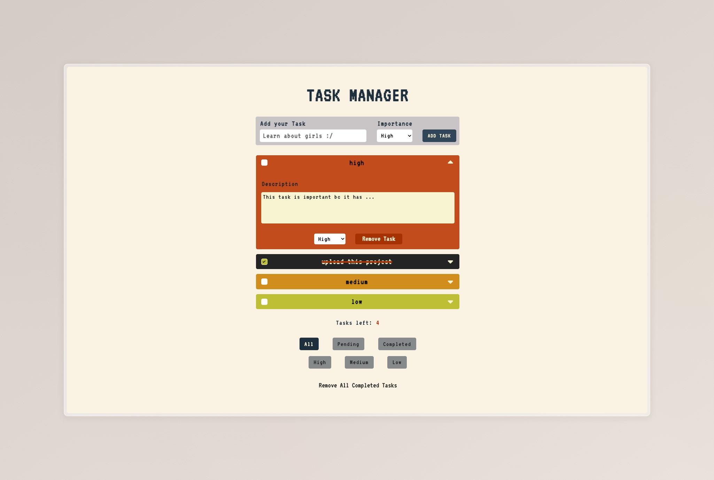

# Task Manager

Task Manager is a modern web application designed to help users manage their daily tasks efficiently. Built with React, this application offers a user-friendly interface for adding, filtering, and tracking tasks.

<!-- ## Live Demo

Experience Task Manager in action. Check out the live demo [here](https://dummy-task-manager.netlify.app/).

This demo gives you a hands-on look at how Task Manager can streamline your task management process. Explore the features, add tasks, and see how it can fit into your daily routine. -->

## Features

- **Add Tasks**: Easily add new tasks with a simple and intuitive interface.
- **Filter Tasks**: Filter tasks based on their status (completed, pending, etc.) to focus on what's important.
- **Task Counter**: Keep track of how many tasks you have completed and how many are still pending.

## Built With

- [React](https://reactjs.org/) - The web framework used
- [Vite](https://vitejs.dev/) - Frontend Tooling
- [TypeScript](https://www.typescriptlang.org/) - Used for static type checking
